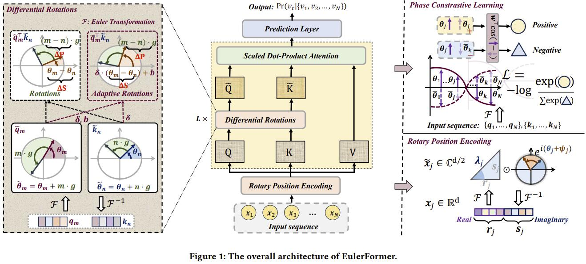

# EulerFormer
[SIGIR 2024] This is the official PyTorch implementation for the paper: "EulerFormer: Sequential User Behavior Modeling with Complex Vector Attention".

## Overview
We proposes a novel transformer variant with complex vector attention, named **EulerFormer**, which provides a unified theoretical framework to formulate both semantic difference and positional difference. 
The EulerFormer involves two key technical improvements. 
First, it employs a new transformation function for efficiently transforming the sequence tokens into {polar-form** complex vectors using Euler's formula, enabling the unified modeling of both semantic and positional information in a complex rotation form.
Secondly, it develops a differential rotation mechanism, where the semantic rotation angles can be controlled by an adaptation function, enabling the adaptive integration of the semantic and positional information according to the semantic contexts.
Furthermore, a phase contrastive learning task is proposed to improve the anisotropy of contextual representations in EulerFormer. 
Our theoretical framework possesses a high degree of completeness and generality (e.g. RoPE can be instantiated as a special case). It is  more robust to semantic variations and possesses more
superior theoretical properties (e.g. long-term decay) in principle.   
Extensive experiments conducted on four public datasets demonstrate the effectiveness and efficiency of our approach.



## Requirements

```
recbole>=1.1.1
python>=3.9.7
cudatoolkit>=11.3.1
pytorch>=1.11.0
```

## Download Datasets

Please download the datasets from [Google Drive](https://drive.google.com/drive/folders/1so0lckI6N6_niVEYaBu-LIcpOdZf99kj) or [百度网盘](https://pan.baidu.com/share/init?surl=p51sWMgVFbAaHQmL4aD_-g) (密码 e272).

## Quick Start

### 1. Clone Framework

We reuse the baseline models and implement our models based on RecBole, an open-source, widely-used benchmark library{https://recbole.io/}.

Follow the steps below to set up RecBole on your local machine.

- Navigate to [RecBole's official website](https://recbole.io/) and download the latest release of the framework.
- After downloading, extract the zip file to a suitable location on your machine.
- Now, locate the `recbole/model/sequential_recommender` directory within the extracted folder.
- Download the files in `EulerFormer_models` provided by us and substitute the files in Recbole.


### 2. Configuring and Running the Model:

Now that the RecBole framework and datasets are ready, follow their instructions to run the EulerFormer model.

- We have provided the configuration files in `config_files`. These files contain the necessary informaiton for running the model.

- We have provided a hyper-parameter file named `hyper-para.test`. This file contains the necessary hyper-parameters.

- The basic search settings of different models follow [recbole's official recommendation](https://recbole.io/hyperparameters/sequential.html).

Wait for the execution to complete, and RecBole will output the results of the model evaluation.